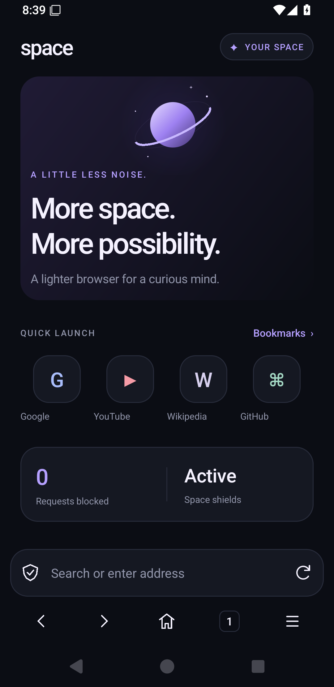
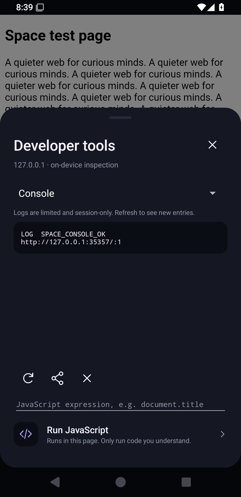

# Space Browser

A small, native Android browser with an original orbital identity, a bottom address bar and a quieter browsing experience. Built for Android 10+ using the device's Android System WebView; it does not bundle another Chromium engine.

## Screenshots

Captured from the actual app on an Android 15 emulator.

| Dark | Light | Developer tools |
| --- | --- | --- |
|  |  |  |

## Download the APK

Open [Releases](https://github.com/ArnavSingh76533/spacebb/releases) and download **Space-Browser.apk** from the newest preview. Allow installation from the app you use to open the APK if Android asks.

Alternatively, open [Actions → Build Space Browser APK](https://github.com/ArnavSingh76533/spacebb/actions/workflows/android.yml), choose a successful run and download **Space-Browser-APK** under Artifacts. Unzip it to get the APK and its SHA-256 checksum. GitHub requires you to be signed in for Actions artifact downloads.

Every push to `main` runs unit tests, Android lint, release shrinking and Android 10 and Android 15 emulator smoke tests. A preview release is published only after those jobs pass. You can also use **Run workflow** in Actions.

## Features

- Original dark and light themes, vector planet artwork, large touch targets and a bottom address/search bar.
- Up to 30 tabs; at most four WebViews are kept live. Other tabs sleep and reload when selected. Regular tab URLs survive app restarts.
- Local domain-based ad/tracker/malware filtering from a bundled StevenBlack unified-hosts snapshot, with per-site exceptions and real blocked-request counts.
- Private browsing in a separate Android process and separate WebView data directory; no saved history, bookmarks or restored tabs. Screenshots and recents previews are protected.
- Bookmarks, local browsing history (latest 500), page search, article reading view, mobile/desktop user agent, share and long-press link actions.
- DuckDuckGo, Brave Search and Google search choices.
- System downloads, file uploads and fullscreen video. Camera/microphone access requires a site prompt and Android runtime permission. Location access is denied.
- Default-browser registration, clear browsing data and a JavaScript toggle.
- Native network inspector: automatic capture, live request list, Overview / Request / Response, headers and POST data, response bodies, Text / Hex / Raw views, decoding, images, JSON tree, search and timing waterfall. **Console and Run JavaScript have been removed.**
- Developer tools open as a native browser tab by default, or a saved popup preference. Filter across one tab or all tabs, pin items, compare two captures, import/export HAR, copy as cURL/Fetch/Python, and explicitly edit/resend a request.
- Space AI: streaming chat through the supplied gateway (`model: auto`, no automatic retries), selectable capture context, default credential masking, context preview and key replacement/removal.

## Lightweight by design

No runtime UI framework, image downloads, analytics SDK, account system, ads in the browser UI, paid subscription, or background filter-update service. The home artwork and icons are drawn as vectors. APK and memory use are different: websites still use the device's WebView renderer, and a heavy website can consume substantial RAM. The APK size is measured in each Actions build summary.

## Privacy and security boundaries

Third-party cookies are disabled. Certificate errors are cancelled, mixed content is blocked, Android WebView Safe Browsing is enabled, and page access to `file://` and `content://` is disabled. No JavaScript-to-Java bridge is exposed. Normal HTTP websites and local development servers remain accessible; HTTP is not encrypted.

Private browsing uses an isolated data directory. Its directory is cleared before each new private process starts and when the session closes. Close private browsing from its menu to end the session; leaving the app temporarily keeps the session open. Files you download and links you copy remain outside private browsing. Private mode is not a VPN or anonymity service. Website operators and your network can still observe traffic.

Normal history, bookmarks and session URLs are stored in app-private preferences; Android backups are disabled. Network captures are session-only. Bodies above 64 KiB spill to app-private cache files; each tab retains at most 12 MiB of bodies, with a 2 MiB per-body limit. Unpinned spill files are deleted on Clear; remaining files are removed when the browser activity closes or on the next process start. Pages may still use their own storage. Clear browsing data closes regular tabs and clears cookies, cache, web storage, HTTP-auth credentials and history. Bookmarks and downloaded files are retained. An open private session must be closed separately.

## Honest limits

This is a WebView-based browser, not a Brave/Chromium fork. Domain filters cannot block all first-party or video ads (including many YouTube ads), and this version does not implement full EasyList cosmetic filtering, extension support, sync, a password manager, VPN or a custom engine-level anti-fingerprinting system. Background media behavior depends on WebView, the website and Android; no background-play guarantee is made.

The inspector uses the real WebView Chrome DevTools Protocol (CDP), without injecting a fetch/XHR shim or replaying requests to obtain responses. The provider controls which events, headers and bodies it exposes. Chromium-decoded response content is available, **not exact compressed HTTP/2 or HTTP/3 wire bytes**. Raw is clearly labeled as a browser representation. Multipart upload file contents, redirect response bodies, evicted resources, some worker traffic and streaming media may be unavailable; notes identify missing/truncated data. New popup windows attach after their initial navigation; reload them for a complete trace.

Live gzip/deflate/Brotli/Zstandard decoding uses WebView's own decoding support. Raw imported gzip/deflate and chunked payloads have explicit decoders; externally compressed Brotli/Zstandard HAR bodies require decompression before import. Fonts and arbitrary binary data are shown as metadata/hex/printable strings, not falsely converted into prose. Protobuf schema decoding is not included. HTML/XML/JS/CSS formatting is a display aid, not a validating language parser.

Reading view uses the page's `article` or `main` content and works best on article sites. Cookie-only authenticated downloads, blob/data downloads, automatic camera capture in the file chooser, geolocation and arbitrary intent links are not supported. Sleeping tabs preserve their URL, not unsent forms or complete in-page state.

## Build locally

Install JDK 17 and an Android SDK containing platform 35 and build-tools 35.0.0. Set `ANDROID_HOME` or create an untracked `local.properties` with `sdk.dir=/your/android/sdk`.

```sh
python3 scripts/prepare-filters.py
./gradlew testDebugUnitTest lintRelease assembleRelease
```

Output: `app/build/outputs/apk/release/app-release.apk`.

The project uses Android Gradle Plugin 8.9.2 and Gradle 8.11.1. Native application code is Java 17; no Kotlin or Compose runtime is bundled.

## Preview signing

The release build is minified and non-debuggable but signed with a **development identity** so it can be installed immediately without asking you for signing secrets. Actions caches the debug keystore to keep preview updates compatible while that cache exists. A cache reset can change the signing identity, requiring an uninstall before installing a newer preview. Uninstalling removes local browsing data. Do not use this identity for a production app-store release; configure a private, backed-up release keystore before public production distribution.

Network capture is on by default as requested and enables this process's WebView debugger. The in-app inspector connects through an abstract Unix socket; Space does not create a TCP debugging port. Authorized ADB debugging clients can also inspect WebViews while capture is enabled. Disable **Settings → Network capture** to turn off capture/debugging.

The explicitly requested temporary gateway key is included in this preview's source and APK. **Space AI → API key** replaces it or removes it (save an empty value). Revoke the preview credential when you finish testing. AI requests are sent only after pressing Send. Common credential fields are masked by default, but arbitrary response content may still be private: Review context shows the exact capture text to be sent. Full HAR exports, clipboard copies and shares preserve sensitive data.

## Tests and filter attribution

Pure JVM tests exercise URL handling and domain-boundary matching. The device test loads an offline HTTP fixture in the actual Android WebView and checks initial-document capture, real User-Agent/custom headers, JSON POST data, response headers/bodies, gzip decoding, binary bytes, redirect hops, search matching, HAR round-trip, credential masking, disk spill/cleanup, pins, native tab/popup layouts, secure settings and private-cookie isolation. It captures the actual application screens. Reports and screenshots are attached to Actions runs.

`app/src/main/assets/filter-source.txt` identifies the exact filter snapshot. The unmodified hosts file retains its attribution header; root and constituent-source licenses are included in `app/src/main/assets/hosts-license.txt` and `third_party/hosts/`. Review upstream changes before replacing this snapshot. Filters do not silently update at runtime.

Space Browser code is MIT licensed. Gradle wrapper files retain their Apache 2.0 notices. Filter data retains its original licenses.

## Network tools architecture

- `CdpSocket`: bounded WebSocket transport to this process's `webview_devtools_remote_<pid>` abstract socket. A unique temporary blank URL identifies the correct tab; `Network.enable` completes before its first normal navigation. The temporary page is removed from back history.
- `NetworkRecorder` / `NetworkRecord`: correlate normal and extra-header events, reused redirect request IDs, response-body results and WebSocket frames. Actual browser response streams are not consumed or replaced. Explicit replay is a separate, clearly labeled HTTP request.
- `CaptureStorage`: lazy app-private body spill files over 64 KiB, with total retention limits. Up to 2,000 entries per tab (configurable 50–2,000); old unpinned entries drop first. Pins survive Clear, but cannot override the configured hard bounds.
- `NetworkInspector`: native recycled `ListView` rows; background search and batched updates about every 150 ms; selectable details, copy/export, side-by-side line comparison, timing and JSON exploration. Full bodies are loaded only for formatting, search or export. Text/hex previews have smaller display limits.
- `NetworkFormats`: charset-aware text, JSON, form, multipart, Base64, URL, JWT, gzip/deflate, chunked, binary views and HAR 1.2 import/export. Missing timings use unavailable values; CDP timing metadata is retained in a Space extension.
- `SpaceAi`: lightweight HTTPS/SSE client for the supplied gateway. All/filtered requests send summaries; a selected request sends headers and decoded bodies. Context is capped at 20,000 characters per item and 60,000 total, with explicit truncation notes. Chat history is bounded; Stop/Close cancels the connection. No analytics or automatic capture uploads.

The inspector covers traffic exposed by the selected Android System WebView, not device-wide UDP/TCP traffic from other apps. It needs neither a VPN service nor an installed interception certificate. Keep Android System WebView updated.
